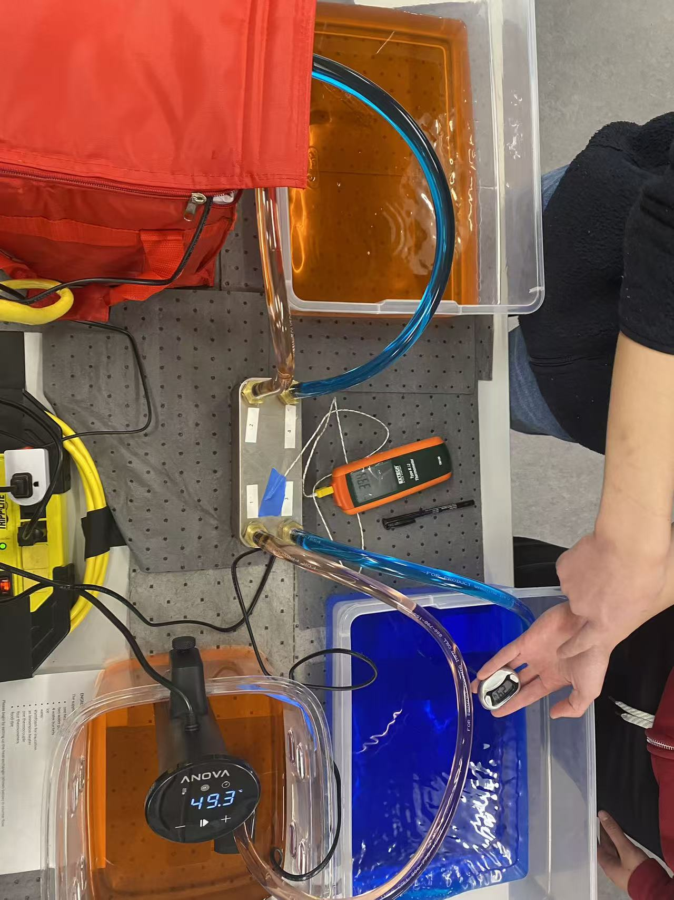
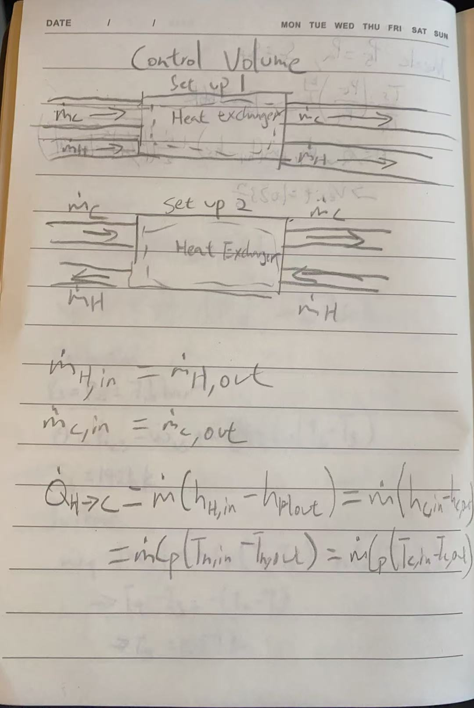

I chose to experiment with the heat exchanger which is a thermal device that transfers heat between 2 flowing fluids without allowing them to mix.
To differentiate the hot and cold water coming from 2 different reservoirs, we dye the hot water red and the cold water blue. 
In real life, the purpose of heat exchanger is to either heat up or cool down a chosen system using the flow of fluids. It is a relatively cheap way of doing so.
In my specific set-up, I started having heat exchangers running in counter-flow, then I compared to the results of them running in parallel flow.
Both set-ups had minimal temperature differences, as the hot water changed from 49.5 celcius to 22 celcius. The cold reservoir changed from 10 to around 30 degrees celcius.
However, the temperature across the heat exchanger itself was greater when we set to parallel instead of counter flow, from 19.5 to 35 degrees celcius as compared to 25 to 30 degrees celcius.
The could be an inaccuracy because we placed the thermometer at a different location。

Below is an attached photo of my set up.

